# TorrentOr

<p align="center">
  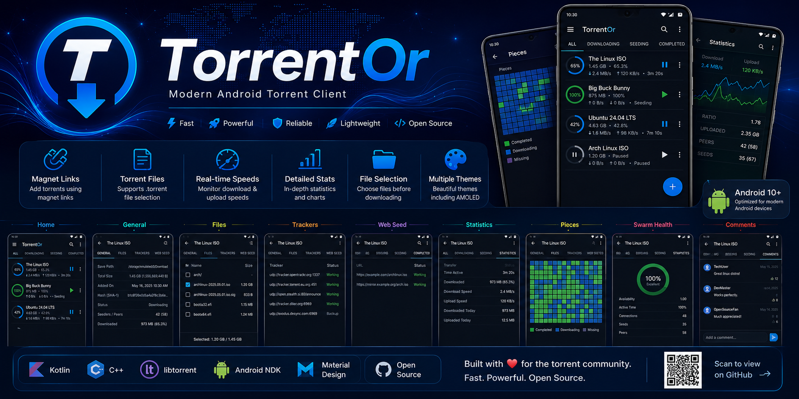
</p>

<h1 align="center">TorrentOr</h1>

<p align="center">
  <b>Modern Android Torrent Client powered by Native libtorrent</b>
</p>

<p align="center">
  
  
  
  
  
  
</p>

---

## About

TorrentOr is a modern Android torrent client built with **Kotlin**, **Android NDK**, and the native **libtorrent** engine.

It provides a fast, lightweight, and polished torrent experience on Android with support for magnet links, torrent files, advanced torrent information, multiple themes, and native download management.

---

## Features

* Native libtorrent backend
* Magnet Link support
* Torrent File support
* Download & Upload speed indicators
* ETA (Estimated Time Remaining)
* Real-time torrent statistics
* Enhanced torrent details
* File selection before downloading
* Tracker management
* Web Seed support
* Swarm Health view
* Pieces information
* Comments section
* Pause / Resume torrents
* Delete torrents with or without downloaded files
* Multiple color themes
* AMOLED theme
* Android Foreground Service
* Native C++ performance using Android NDK

---

# Screenshots

## Theme Gallery

<p align="center">
  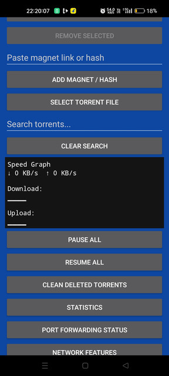
  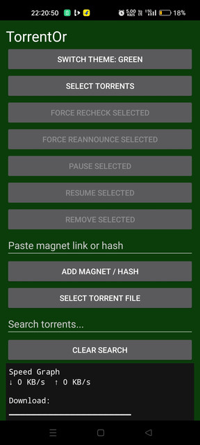
  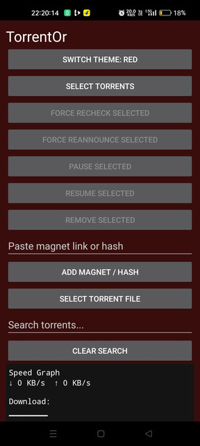
  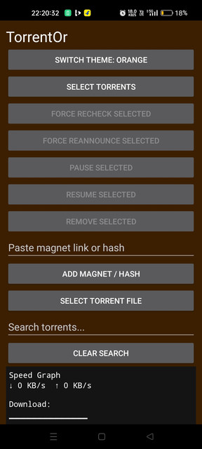
</p>

<p align="center">
  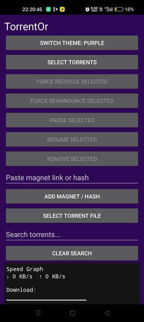
  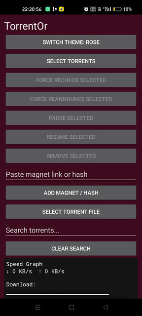
  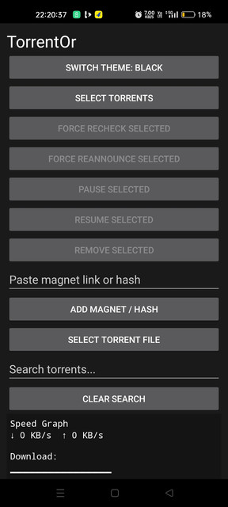
  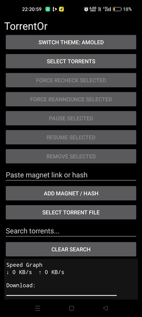
</p>

---

## Torrent Details

<p align="center">
  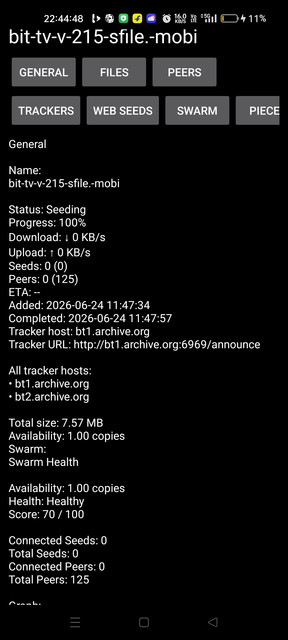
  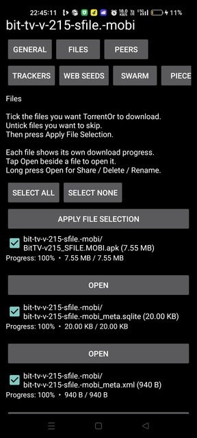
  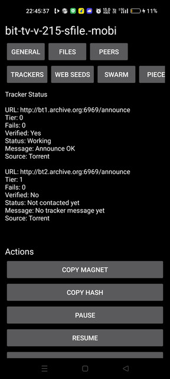
  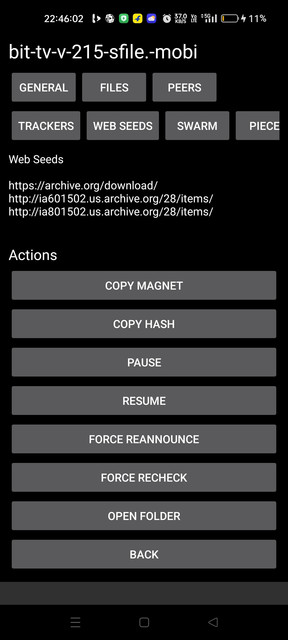
</p>

<p align="center">
  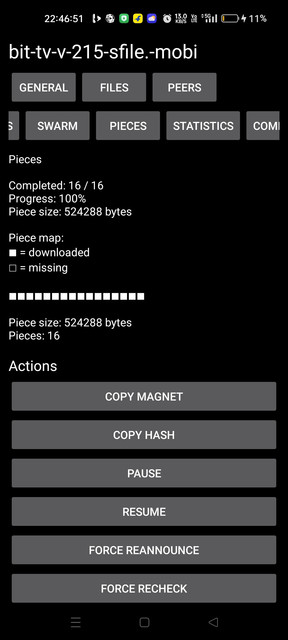
  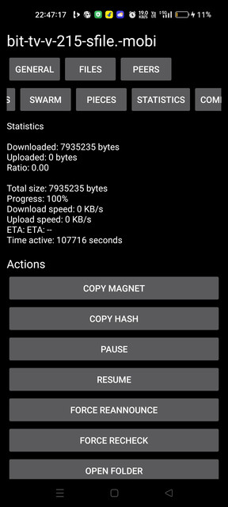
  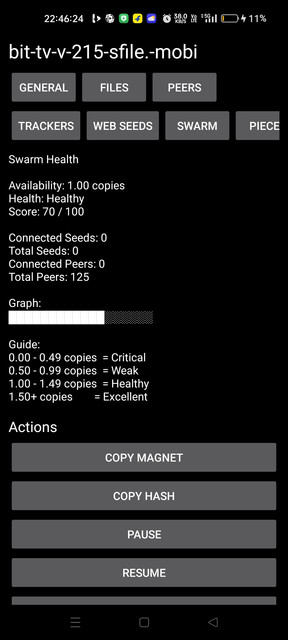
  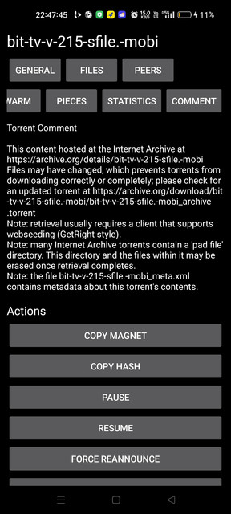
</p>

---

## Tech Stack

* Kotlin
* Android SDK
* Android NDK
* Native C++
* libtorrent
* CMake
* Gradle
* Material Design Components

---

## Requirements

* Android 10+
* Android Studio
* Android NDK
* CMake
* JDK 17

---

## Building

Clone the repository:

```bash
git clone https://github.com/a79user-ship-it/TorrentOr.git
cd TorrentOr
```

### Windows

```cmd
gradlew.bat assembleDebug
```

### Linux / macOS

```bash
./gradlew assembleDebug
```

Generated APK:

```text
app/build/outputs/apk/debug/
```

---

## Contributing

Contributions, bug reports, and feature requests are welcome. Feel free to open an issue or submit a pull request.

---

## License

This project is licensed under the MIT License.

---

## Disclaimer

TorrentOr is intended for downloading and sharing legal content only.

Users are responsible for complying with the copyright laws applicable in their country.

---

<p align="center">

Made with ❤️ using Kotlin, Android NDK and native libtorrent.

</p>

## Known Issues

TorrentOr is still under active development. The following issues are currently known:

### Paused Torrents Resume Automatically

In some cases, torrents that have been manually paused may automatically resume after restarting the app. This behavior is unintended and is being investigated.

### Previously Deleted Torrents Reappear

Torrents that have been deleted may reappear after installing the app on another device or after a fresh installation. This is a known issue related to torrent state persistence and will be fixed in a future update.

These issues are known and are being actively worked on. Thank you for your patience and support.
